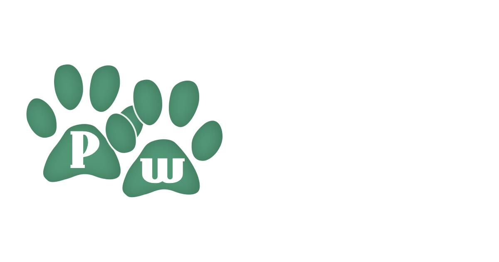
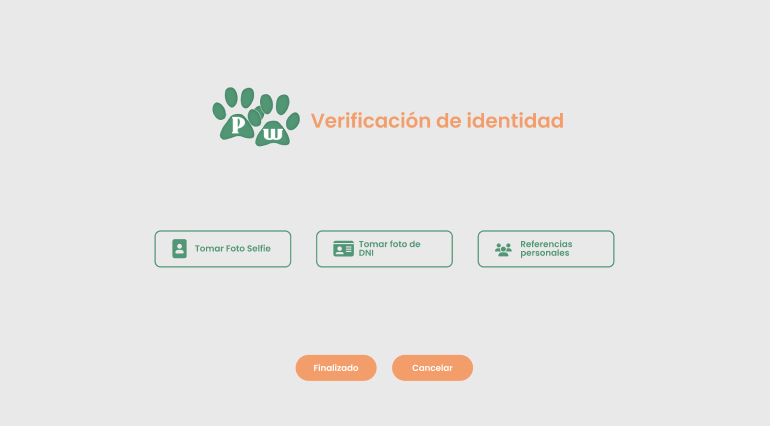

# PetWalk - Prueba Vortex Soluciones



## Guía de instalación 

1. Clonar proyecto ```git clone https://github.com/diegopolor/PetWalk```
2. Instalación de paquetes ``` npm install ```
3. Ejecutar JSON-server ``` npm run backend ```
4. Ejecutar proyecto ``` npm start ``` o ``` ng serve -o ```


## Concepto de Aplicativo

PetWalk es una aplicación web diseñada para facilitar la vida de los inquilinos de un conjunto residencial que, debido a sus ocupaciones diarias, no disponen del tiempo suficiente para sacar a pasear a sus mascotas. La plataforma conecta a estos inquilinos con jóvenes entusiastas que están dispuestos a sacar a pasear a las mascotas en los horarios que les resulten más convenientes. De esta manera, los inquilinos pueden asegurarse de que sus adoradas mascotas reciban el ejercicio y la atención que necesitan, mientras los jóvenes se benefician de una oportunidad para ganar un dinero extra y disfrutar de la compañía de las mascotas. PetWalk se encarga de hacer coincidir a los inquilinos y a los jóvenes paseadores de perros de forma segura y eficiente, brindando una solución conveniente y confiable para satisfacer las necesidades de todos los involucrados.

Idea base en excalidraw: https://excalidraw.com/#json=RtPbqB4caAvRrcybGnZMl,EaB7LIoSdjyVZwV2dJ-cow

## Seguridad

PetWalk podría contar con un sólido sistema de verificación de identidad que brindaría tranquilidad a los inquilinos




## Monetización

El aplicativo PetWalk tiene varias oportunidades para monetizar y generar ingresos. Algunos puntos a considerar son:

- Comisión por transacciones
- Programa de afiliados: Se puede establecer alianzas con tiendas de mascotas u otros negocios 
relacionados y crear un programa de afiliados. Recomendando productos o 
servicios a los usuarios de la aplicación y, si realizan compras a través 
de los enlaces de afiliado, se recibirá una comisión por esas ventas.
- Planes premium: Sería un plan premium para los inquilinos, 
este incluiría las siguientes ventajas:

    - Creación de oferta para ser encontrado por los cuidadores.
    - Disminución de las comisiones por transacción a un 0%.
  

## Entregables

- PetWalk Mockups : https://drive.google.com/file/d/1r7cjgD-KRQ4XBrRnmwNaBsCZhVCZfM25/view?usp=sharing
- Imagen Conceptual ( Qué podría ofercer el aplicativo): https://drive.google.com/file/d/1HW11GYFFi9b2RBNtPZciYlGLgrfbWh5W/view?usp=drive_link

